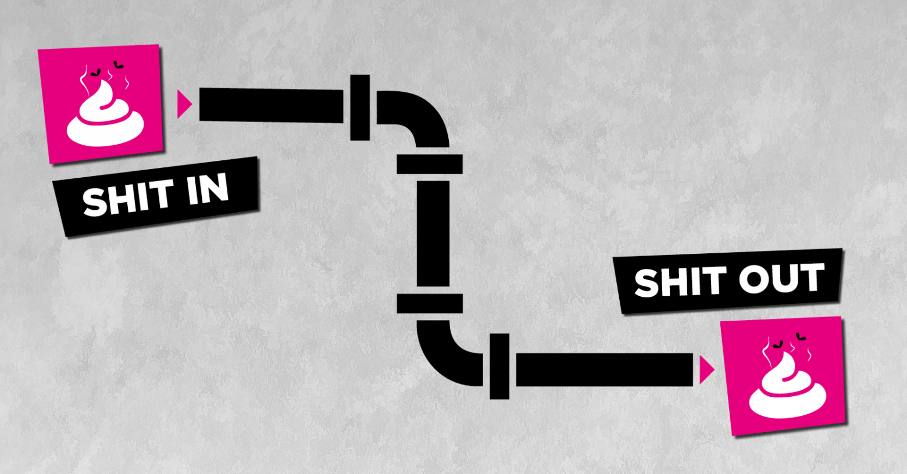

# cx-tekton-catalog
simple tekton catalog

## Motivation
Die Bereitstellung von Tekton Elementen erfolgt recht simpel in Verzeichnisstrukturen. Wenn es um die Bereitstellung und den Lifecycle aller Elemente geht, scheint man auf sich allein gestellt zu sein. 

Genau wie produktive Anwendungen sind CI/CD Werkzeuge angreifbar und sollten die hoffentlich existierende gleiche Achtsamkeit erhalten. Kontinuierliche Überprüfungen auf bekannte Schwachstellen, die Lauffähigkeit der angebotenen Features und der Lifecycle eingebundener Abhängigkeiten sollten nie aus dem Auge verloren gehen.

Wer veraltete und kaputte CI/CD Werkzeuge einsetzt sollte sich nicht bescheren, wenn er kaputte Software baut und ausliefert.



## Installation / Bereitstellung des Kataloges

### Voraussetzungen
- Es steht ein Kubernetes Cluster zur Verfügung.
- Im Cluster wurde Tekton bereits installiert: https://redhat-scholars.github.io/tekton-tutorial/tekton-tutorial/setup.html

## Layout

Layout of files in the project:
```
cx-tekton-catalog
├── config                          - Tekton Pipelines Konfigurationen - Defaults zu Tasks und Pipelines + Feature Flags
├── dashboard                       - Ressourcen zu Tekton Dashboard - Ingress
├── extensions                      - weitere Konfigurationsdateien zu Namespace und Cluster (falls was mit der Installation von Tekton oä fehlen)
|
├── pipeline                        - Einstieg zu Pipelines -> eine Pipeline pro Verzeichnis inklusive Tests
│   └── pipeline-name               - Verzeichnis zu einer Pipeline
│       └── pipeline-version        - Verzeichnis zu einer Version der Pipeline
│           ├── pipeline-name.yaml  - Datei zu einer Pipeline
│           └── test                - Verzeichnis mit Dateien für die Tests zur Pipeline
│               ├── resources.yaml  - Ressourcen, die für die Tests benötigt werden - z.B. PVC, Deployment, ServiceAccount, etc.
│               └── run.yaml        - PipelineRun(s) die den, die Tests ausführen
|
├── scripts                         - Hier liegen alle Scripts, die für die Installation und Deinstallation des gesamten Kataloges angeboten werden
|
├── task                            - Einstieg zu Tasks -> ein Task pro Verzeichnis inklusive Tests
│   ├── catalog.yaml                - Liste von Tasks, die aus einem anderen Katalog installiert werden sollen (z.B. Tekton catalog)
│   └── task-name                   - Verzeichnis zu einer Task
│       └── task-version            - Verzeichnis zu einer Version der Task
│           ├── task-name.yaml      - Datei zu einer Task
│           └── test                - Verzeichnis mit Dateien für die Tests zur Pipeline
│               ├── resources.yaml  - Ressourcen, die für die Tests benötigt werden - z.B. PVC, Deployment, ServiceAccount, etc.
│               └── run.yaml        - TaskRun(s) die den, die Tests ausführen
|
└── trigger                         - Tekton Trigger Dateien
    └── trigger-name                - Verzeichnis zu einem Trigger
        └── trigger-version         - Verzeichnis zu einer Version des Triggers
            └── *.yaml              - Dateien zu einem Trigger
```
